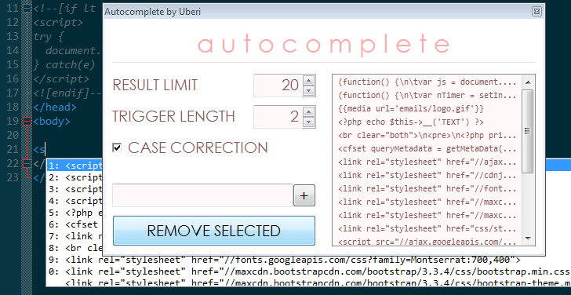

Autocomplete by Uberi
=====================
As-you-type suggestions anywhere!

# [Get it now](https://github.com/Uberi/Autocomplete/releases/)

Using
-----

1. Extract the archive to a safe location.
2. If you downloaded the binaries, open `Autocomplete.exe`.
3. If you downloaded the source, make sure you have a recent version of [AutoHotkey](http://www.autohotkey.com/) installed, and run `Autocomplete.ahk`.
4. Start typing somewhere. After the first few characters, a suggestion box will appear.
5. Use the `Up` and `Down` arrow keys to select an entry if the currently selected one is incorrect.
6. Press `Enter` or `Tab` to trigger the completion.

Advanced
--------

Click on the tray icon to bring up the settings dialog. The dialog allows you to configure settings such as the maximum number of results to show at a time and the number of characters to type before showing suggestions.

The dialog also allows you to edit the wordlist by adding or removing words. All settings are saved automatically upon program exit.

The wordlist is contained in `WordList.txt`. Each line represents a word. The list can be edited with a text editor, but ensure the editor supports larger files before doing so! Some may crash or hang upon editing such files.